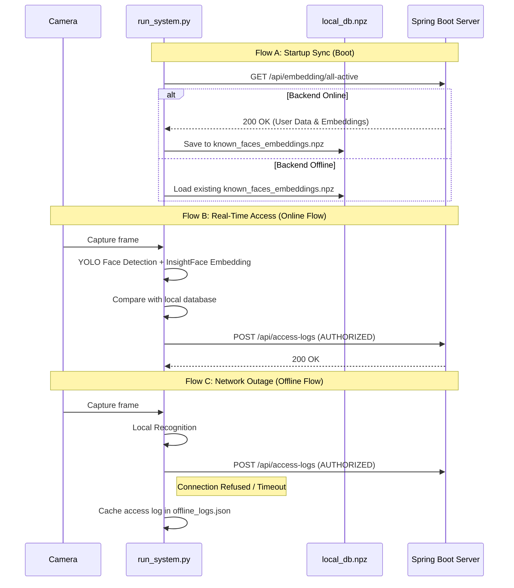

# Face Recognition System: Architecture and Integration Flows

This document details the system architecture, integration flows, and data structures utilized between the Raspberry Pi edge device and the centralized Spring Boot backend server.

---

## 1. System Components

### 1.1. Edge Node (Raspberry Pi 5)
Handles computationally expensive deep learning operations (YOLO-based face detection and InsightFace-based feature extraction) locally. The edge logic is managed by `src/run_system.py`.
- **Camera Module:** Captures the real-time frame stream (via Picamera2 on Raspberry Pi or OpenCV on MacBook/Windows).
- **YOLO & FaceRecognizer:** Locates faces in the frame and extracts a 512-dimensional vector (embedding).
- **Local Database (Cache):** Fast lookup database kept in RAM and serialized to disk as `known_faces_embeddings.npz`.
- **Backend Client:** Handles HTTP requests and responses to keep embeddings and logs synchronized (`src/backend_client.py`).
- **FastAPI Web Server:** Listens on port `8000` to process webhook endpoints (`/reload`, `/generate`) triggered by the Spring Boot server.

### 1.2. Central Backend (Spring Boot Server)
Serves as the system database, administrative portal, and event log manager.
- **User & Role Management:** Manages administrative permissions, personnel lists, and roles.
- **Log Management:** Records access events sent from edge devices for audit reports.
- **Synchronization API:** Serves `/api/embedding/all-active` to provide the RPi with current face embeddings and notifies edge units of database updates via POST webhooks.

---

## 2. Dynamic Integration Flows

To ensure fault tolerance, low latency, and zero data loss during network disruptions, the system employs **Offline-First** and **Eventual Consistency** patterns.

### Flow A: Initial Boot Sync
Triggered when the RPi face recognition system starts up:
1. The RPi initializes and loads the YOLO and InsightFace neural networks into memory.
2. In a background thread, the backend client requests the latest personnel dataset:
   `GET /api/embedding/all-active`
3. The Spring Boot backend returns JSON containing names, IDs, list classifications, and 512D vectors.
4. The RPi saves this response to the local `known_faces_embeddings.npz` cache and loads it into memory.
5. If the backend is unreachable, the system falls back to the existing `.npz` cache and starts normally.

### Flow B: Live Online Authorization
Triggered when a person is detected by the camera:
1. The camera captures a frame; YOLO detects face coordinates, and the recognizer extracts a normalized 512D vector.
2. The RPi performs a matrix dot-product (Cosine Similarity) against the memory-cached database.
3. If similarity exceeds the threshold, the system displays a verification banner.
4. The RPi immediately posts the log:
   `POST /api/access-logs` with JSON data (UserId, access status, timestamp, device identifier).
5. The backend writes this access record to the database.

### Flow C: Offline Caching
Triggered during a network outage or backend server downtime:
1. The local recognition loop continues to verify personnel normally (ensuring the door or turnstile opens without delay).
2. The HTTP request to `/api/access-logs` fails due to a network timeout or exception.
3. Instead of dropping the log, the RPi writes the log entry to `offline_logs.json`.
4. Consecutive offline events are appended to this file.

### Flow D: Connection Recovery and Bulk Sync
Triggered when the network connection is restored:
1. Upon the *next successful* face recognition, the RPi successfully posts the current log to `/api/access-logs`.
2. Receiving a `200 OK` indicates that the network is online.
3. The RPi immediately spawns a background thread to process `offline_logs.json`.
4. Cached logs are posted as a bulk array to:
   `POST /api/access-logs/batch`
5. The backend processes the array, writes them to the database, and returns `200 OK`.
6. The RPi deletes the local `offline_logs.json` file.

### Flow E: Real-time Database Reload (Webhook)
Triggered when administrative changes occur (e.g., enrolling a new employee or blacklisting an ID):
1. The administrator updates user status in the backend console.
2. The backend sends a webhook to the RPi FastAPI server:
   `POST http://<RPI_IP>:8000/reload`
3. The RPi FastAPI listener accepts the request and triggers a background sync task.
4. The RPi downloads updated embeddings, serializes them to the `.npz` cache, and updates RAM arrays safely (protected by database locks).
5. The system recognizes the changes in subsequent camera frames.

### Flow F: Feature Vector Generation
Triggered during the user enrollment step:
1. The administrator uploads a personnel photograph in the backend console.
2. The backend posts the raw photo to the RPi FastAPI parser:
   `POST http://<RPI_IP>:8000/generate`
3. The RPi locks resources, runs YOLO face detection, crops the face ROI, extracts the 512-dimensional vector, and returns it as a JSON payload:
   `{"embedding": [0.0123, -0.0456, ...]}`
4. The backend registers the user along with this vector in its own database, making future syncs instant.

---

## 3. Resource & Thread Safety Management

Due to the asynchronous nature of background FastAPI calls running alongside the main camera frame loop, three synchronization locks are implemented:
- **Inference Lock (`_inference_lock`):** Prevents concurrent access to the GPU/CPU neural network models. If the FastAPI server receives an image for vector extraction (`/generate`) while the camera loop is running inference on a frame, the lock ensures they are processed sequentially, preventing segmentation faults.
- **Database Lock (`_db_lock`):** Ensures thread-safe updates to the database array inside RAM. When a webhook triggers `/reload`, the database lock prevents the main thread from reading name/embedding indices while they are being overwritten.
- **Log Lock (`_log_lock`):** Serializes writes to `offline_logs.json` to prevent file corruption if multiple unrecognized faces are processed in rapid succession during network downtime.
